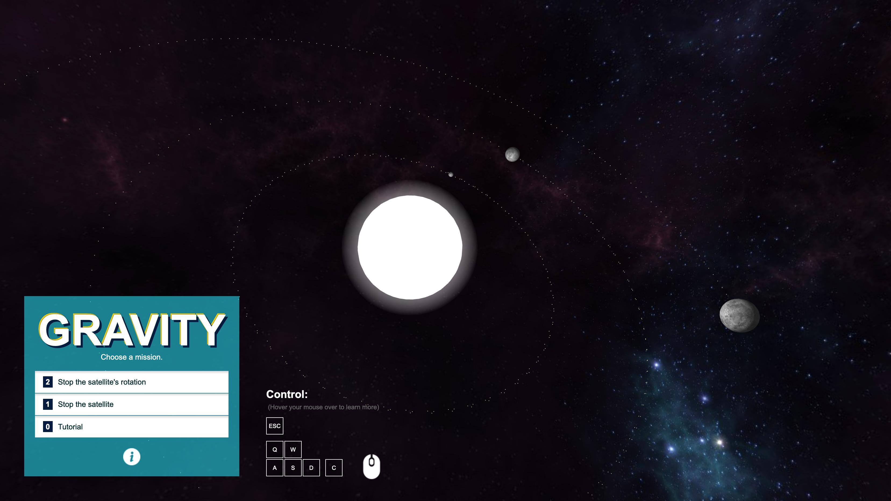

# Gravity Game JS

 

Control a spaceship in a space with the gravity. Feel the real gravity!

**The game supports only desktops. Mobile is not supported.**

[Play Online](http://n4no.com/projects/gravity/)

## License

Gravity is open-sourced software licensed under the [MIT license](http://opensource.org/licenses/MIT).
